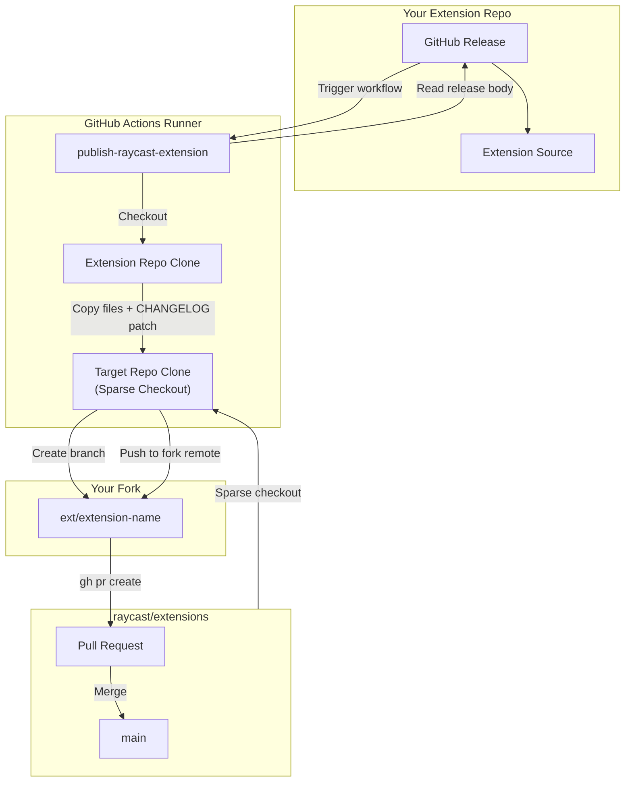
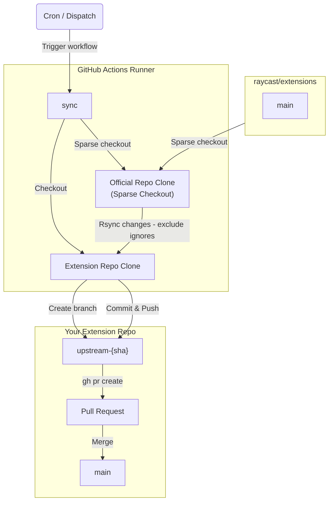

# Raycast Extension Actions

> This repository is a unified fork and improvement of [timrogers/publish-raycast-extension](https://github.com/timrogers/publish-raycast-extension) and [timrogers/pull-raycast-extension-changes](https://github.com/timrogers/pull-raycast-extension-changes).

This repository contains two GitHub Actions to help you manage your Raycast extensions smoothly between your local repository and the official `raycast/extensions` repository.

1. **[Publish Raycast Extension](#1-publish-raycast-extension)**: Publish changes from your local repository to the official repository.
2. **[Pull Raycast Extension Changes](#2-pull-raycast-extension-changes)**: Sync upstream changes from the official repository back to your local repository.

With these two actions, your extension can live in your own repo, but be automatically synced in both directions with `raycast/extensions`.

---

## 1. Publish Raycast Extension



This action allows you to store a custom extension in your own repo, and automatically publish changes to the central `raycast/extensions` repo.

### Features & Improvements

- **Performance Boost**: Uses Git sparse-checkout and partial clone to drastically reduce clone time.
- **Better PR Creation**: Automatically generates Pull Requests with the official Raycast PR template.
- **Intelligent `CHANGELOG.md` Date Replacement**: Safely replaces the release date in your changelog.
- **Ignored Paths**: Specify custom paths to exclude via `ignore_paths`.

### Usage

1. Fork the `raycast/extensions` repo.
2. Add a Personal Access Token (`repo` and `workflow` scopes) as a secret named `GH_ACCESS_TOKEN`.
3. Create `.github/workflows/release.yml`:

```yaml
name: Publish to Raycast
on:
  release:
    types: [published]

permissions:
  contents: read

jobs:
  publish:
    runs-on: ubuntu-latest
    steps:
      - uses: maxchang3/raycast-extension-actions/publish@v1
        with:
          raycast_extensions_fork_full_name: your-username/extensions
          github_username: your-username
          extension_name: your-extension-name
          github_access_token: ${{ secrets.GH_ACCESS_TOKEN }}
          # OPTIONAL: List of paths to ignore
          # ignore_paths: |
          #   .vscode
          #   .github
```

---

## 2. Pull Raycast Extension Changes



This action automatically creates a PR to your repo whenever any changes are made to your extension "upstream" in the `raycast/extensions` repo.

### Features & Improvements

- **Smart Syncing & Ignored Files**: The `ignore_paths` parameter allows you to seamlessly exclude specific files or folders from the upstream sync, keeping your local version completely untouched (e.g. `CHANGELOG.md`).

### Usage

1. Create a `.github/workflows/pull_upstream_changes.yml` file:

```yaml
name: Pull upstream changes
on:
  schedule:
    - cron: "0 5 * * *"
  workflow_dispatch:

permissions:
  contents: write
  pull-requests: write

jobs:
  build:
    runs-on: ubuntu-latest
    steps:
      - uses: maxchang3/raycast-extension-actions/sync@v1
        with:
          extension_name: your-extension-name
          # Optional: List of files/folders you DO NOT want to sync back
          ignore_paths: |
            CHANGELOG.md
            .github/
          github_access_token: ${{ secrets.GITHUB_TOKEN }}
```
