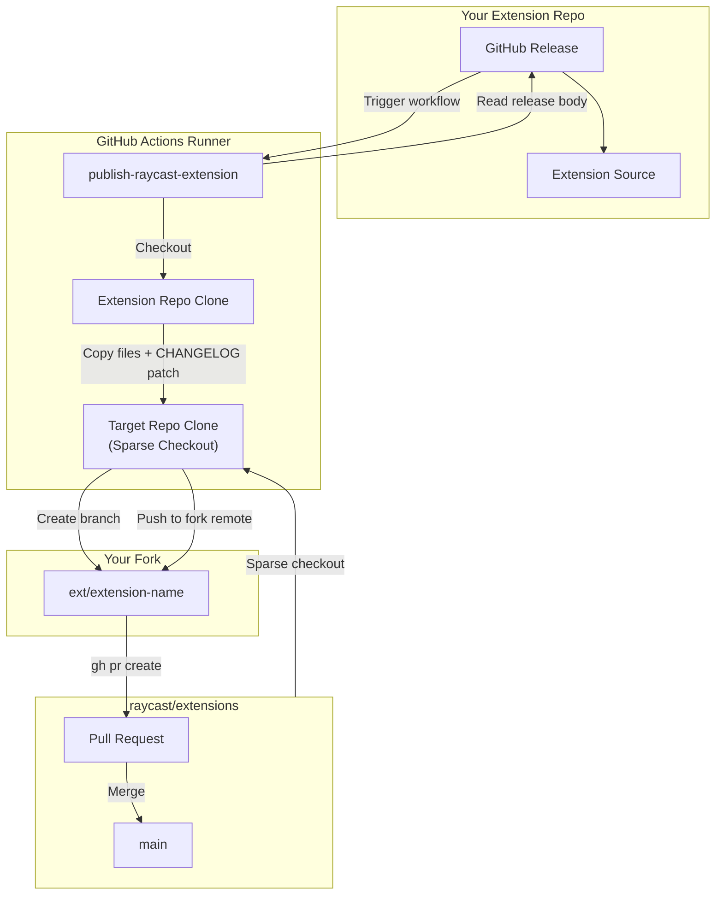
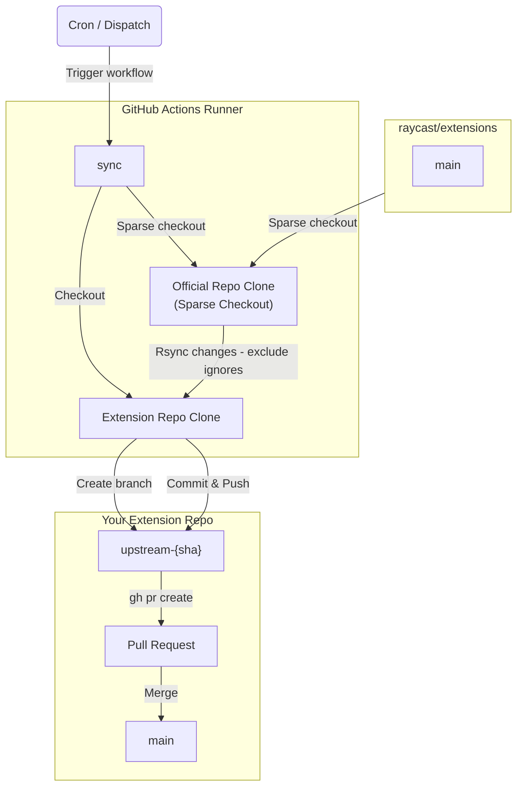

# Workflow

## 1. Publish Raycast Extension

```mermaid
graph TB
    subgraph MyRepo["Your Extension Repo"]
        Release["GitHub Release"]
        Source["Extension Source"]
    end

    subgraph Runner["GitHub Actions Runner"]
        Action["publish-raycast-extension"]

        ExtensionClone["Extension Repo Clone"]
        TargetClone["Target Repo Clone<br/>(Sparse Checkout)"]
    end

    subgraph ForkRepo["Your Fork"]
        Branch["ext/extension-name"]
    end

    subgraph OfficialRepo["raycast/extensions"]
        Main["main"]
        PR["Pull Request"]
    end

    Release --> Source
    Release -->|Trigger workflow| Action
    Action -->|Checkout| ExtensionClone
    Action -->|Read release body| Release

    OfficialRepo -->|Sparse checkout| TargetClone

    ExtensionClone -->|Copy files + CHANGELOG patch| TargetClone
    TargetClone -->|Create branch| Branch
    TargetClone -->|Push to fork remote| Branch

    Branch -->|gh pr create| PR
    PR -->|Merge| Main
```

## 2. Sync `raycast/extension` Changes

```mermaid
graph TB
    subgraph MyRepo["Your Extension Repo"]
        Source["main"]
        SyncBranch["upstream-{sha}"]
        LocalPR["Pull Request"]
    end

    subgraph Runner["GitHub Actions Runner"]
        Action["sync"]

        ExtensionClone["Extension Repo Clone"]
        TargetClone["Official Repo Clone<br/>(Sparse Checkout)"]
    end

    subgraph OfficialRepo["raycast/extensions"]
        Main["main"]
    end

    Schedule("Cron / Dispatch") -->|Trigger workflow| Action
    Action -->|Checkout| ExtensionClone
    Action -->|Sparse checkout| TargetClone

    OfficialRepo -->|Sparse checkout| TargetClone

    TargetClone -->|Rsync changes - exclude ignores| ExtensionClone
    ExtensionClone -->|Create branch| SyncBranch
    ExtensionClone -->|Commit & Push| SyncBranch

    SyncBranch -->|gh pr create| LocalPR
    LocalPR -->|Merge| Source
```
